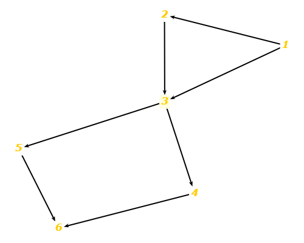

# Exercise 7.4.3
## Question
```Java
public static void f1 (int x, int y)
{
  if (x < y) { f2 (y); } else { f3 (y); };
}
public static void f2 (int a)
{
  if (a % 2 == 0) { f3 (2*a); };
}
public static void f3 (int b)
{
  if (b > 0) { f4(); } else { f5(); };
}
public static void f4() {... f6()....}
public static void f5() {... f6()....}
public static void f6() {...}
```
Use the following test inputs:
t1 = f1 (0, 0)
t2 = f1 (1, 1)
t3 = f1 (0, 1)
t4 = f1 (3, 2)
t5 = f1 (3, 4)

## Answer
### a) Draw the call graph for this program fragment.



### b) Give the path in the graph followed by each test.
* T1: (f1, f3, f5, f6)
* T2: (f1, f3, f4, f6)
* T3: (f1, f2)
* T4: (f1, f3, f4, f6)
* T5: (f1, f2, f3, f4, f6)

### c) Find a minimal test set that achieves Node Coverage.
[3,5,6]
[1,2,3,4,6]
-> {t1, t2, t3}, {t1, t3, t4}, or {t1, t5}

### d) Find a minimal test set that achieves Edge Coverage.
[3,5,6]
[1,3,4,6]
[1,2,3,4,6]
-> {t1, t5}

### e) Give the prime paths in the graph. Which prime path is not covered by any of the tests above?
TR Prime path:
[1,2,3,4,6]
[1,2,3,5,6]
[1,3,4,6]
[1,3,5,6]
-> [1,2,3,5,6]